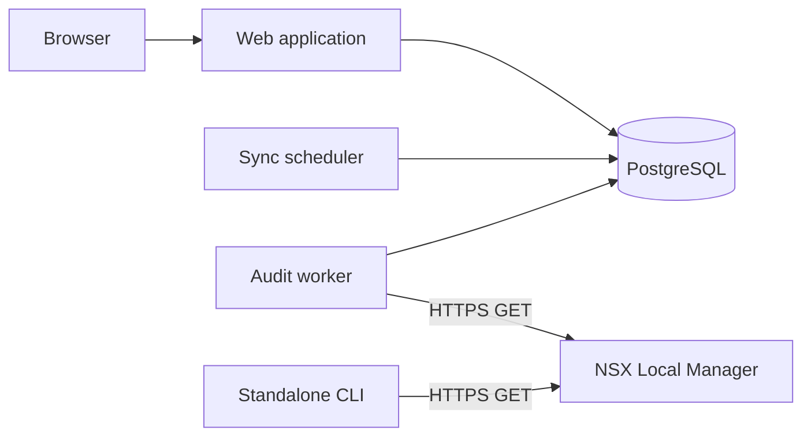

# Architecture

The web process handles authentication, environment configuration, queued collection
requests and report rendering. It does not wait for a live NSX collection during
a page request. PostgreSQL stores accounts, settings, collection jobs and snapshots;
report data is stored as JSONB. The viewer renders from that saved data. Legacy HTML
storage remains for database compatibility and is not used by the viewer.

The scheduler checks enabled environments and their sync intervals. The worker
claims queued jobs, invokes `nsx-inventory.py`, updates progress and saves a snapshot.
A conditional database constraint prevents two active collections for one environment.
Job configuration captures the environment settings at queue time. Collection
concurrency adapts internally; it is not an environment form setting.

The shared collector reads inventory and search references, checks membership and
retrieves counters. Failed or incomplete checks retain uncertainty. History analysis
uses saved observations and identity checks; it cannot reconstruct unseen traffic.

The CLI uses the same collector but writes standalone HTML/JSON files. The web
workspace stores snapshots in the database and does not offer JSON report import.

## Layout

- `nsx-inventory.py`: collector, CLI and report renderer.
- `test_nsx_inventory.py`: offline collector and generated JavaScript tests.
- `webapp/config/`: application configuration and URL setup.
- `webapp/inventory/`: models, migrations, jobs, views, forms and tests.
- `webapp/templates/`, `webapp/static/`: integrated UI.
- `webapp/compose*.yaml`: bundled and remote PostgreSQL deployment.
- `docs/`: product and operating references.
